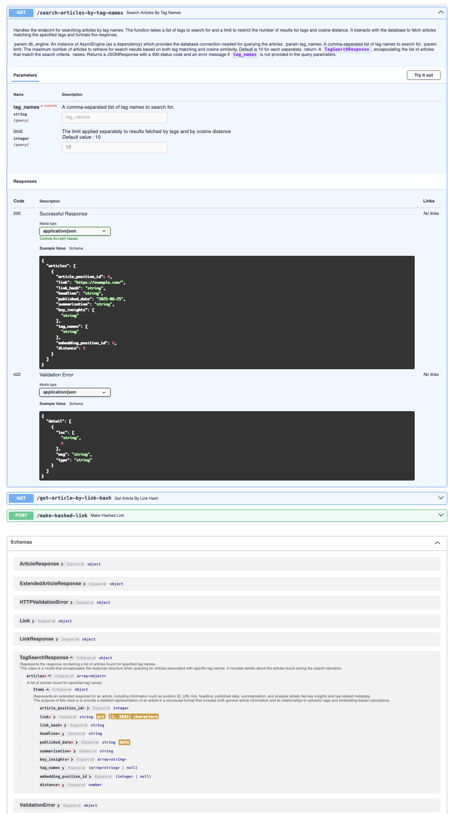
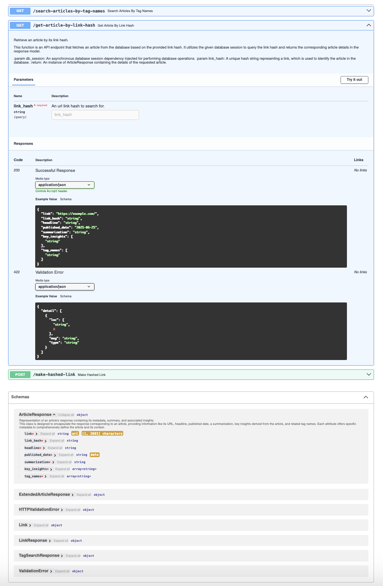
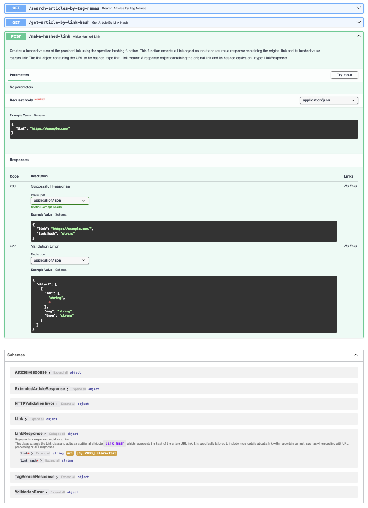

# MCP server based on fastapi_mcp library for searching articles from Huffington Post (science category)

## IMPORTANT

I used ["News Category Dataset"](https://www.kaggle.com/datasets/rmisra/news-category-dataset/data) which
includes information about articles from Huffington Post for my analysis.

## Data preparation

### Science category extraction

Kaggle dataset was filtered to:
* extract science category only
* extract entries with correct urls
* limit dataset to articles not older than from 2015-01-01

See: [Data extractor](app/transformations/extractor.py) and [science_category.jsonl](app/data/science_category.jsonl)

### Website scrapper

`ThreadPoolExecutor` and `BoundedSemaphore` together with `aiohttp` and `BeautifulSoup` were used
to fetch articles text from Huffington Post website.

See: [Scrapper](app/transformations/scrapper.py) and [science_category_content.jsonl](app/data/science_category_content.jsonl).

### Batch files for OpenAI

There were 1012 url links selected from science category and their contents were fetched in previous stages.

In this stage the final file produced by scrapper was divided into files including 50 rows each for `openai.batches`
endpoint. All in jsonl format. Those files are in [app/data/batch](app/data/batch) directory.

See: [prepare_batch_requests](app/transformations/batch_summarizer.py)

### LLM summaries through openai.batches endpoint

I have such an idea to build a chatbot which will be able to answer questions related to science.
This chatbot will answer questions based of knowledge from the selected set of articles.
LLM will be asked to generate a list of tags related to the question and MCP tool will be used
to select articles including those tags and also an embedding vector will be created from those tags
and results based on cosine similarity will be sent to LLM as well.

Website contents fetched in the scraping phase were sent to OpenAI to prepare information related to each article:
* summarization
* key insights
* tags

The idea was to create such summaries to use this data to help answer questions related to the science category based
of the chosen set of articles.
Having a search which will be based on data prepared by LLM from website content and search based on embeddings will 
allow to find the best answers and compare the correctness of search based on data and embeddings.

See: [batch_summarizer.py](app/transformations/batch_summarizer.py) and [app/data/llm](app/data/llm) directory.

At the end of this process file [science_category_llm_summaries.jsonl](app/data/science_category_llm_summaries.jsonl).
This file includes summaries for all selected links.

### Data upload

This stage includes joining data from kaggle dataset and llm and inserting them to a database.

* Database: PostgreSQL with vector extension - [model in sqlalchemy](app/models/articles.py)
* Data upload utils: [data_upload.py](app/api/data_upload.py)
* Embeddings in the database are created using OpenAI endpoint
* There are also tests created where emebeddings are created using a HuggingFace model, see: [test_data_upload.py](tests/test_data_upload.py)

### Endpoints

There are 3 endpoints created, see the image below:

* `/search-articles-by-tag-names` which responses with a set of article on combined tags search and embeddings search. Tags list includes only those tags sent as input value.



* `/get-article-by-link-hash` - returns full gathered info about an article



* `/make-hashed-link` - returns hashed representation of a link



* There are tests prepared for each endpoint [test_articles_search.py](tests/test_articles_search.py)

### MCP server

Tools for MCP server are created from endpoints using `fastapi-mcp` library.

MCP server is configured in [main.py](app/main.py) file.

There is also a simple helper [script](tools_checker.py) which displays exposed tools:

```bash
# python tools_checker.py
Available tools from SSE MCP server: ['search_articles_by_tag_names', 'get_article_by_link_hash', 'make_hashed_link']
```
